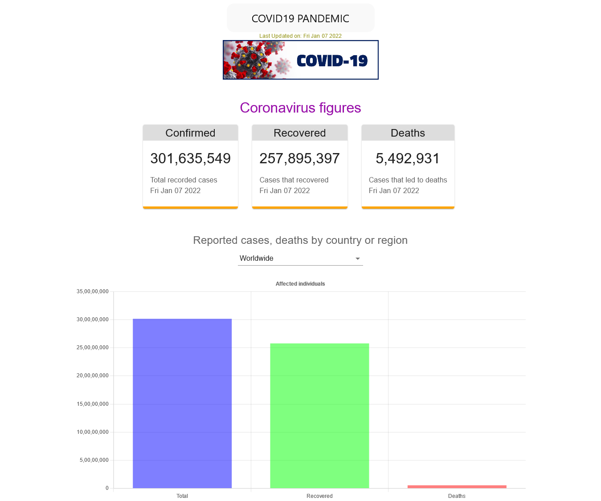

# COVID-19 Dashboard

---

This app features a dashboard which displays the **number of coronavirus cases thus detected so far** (worldwide or for a country), **number of patients that recovered, and number of deaths that occured due to COVID-19.**

## A snapshot of the website

This project can be viewed [here](https://nervous-golick-1e2d94.netlify.app/)

---

**API employed:** [disease.sh](disease.sh/v3/covid-19)